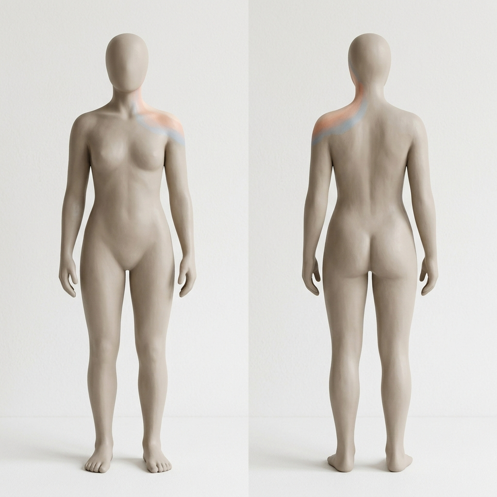
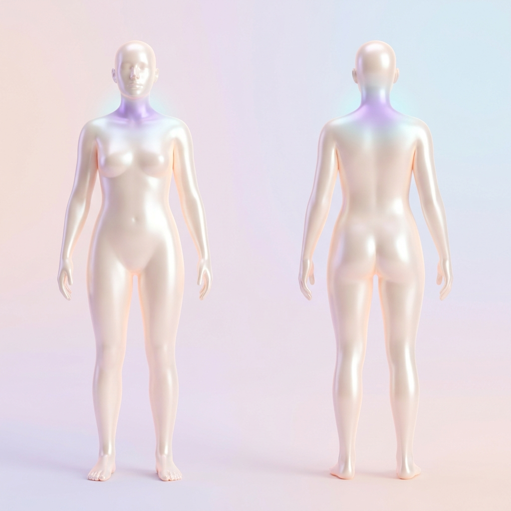
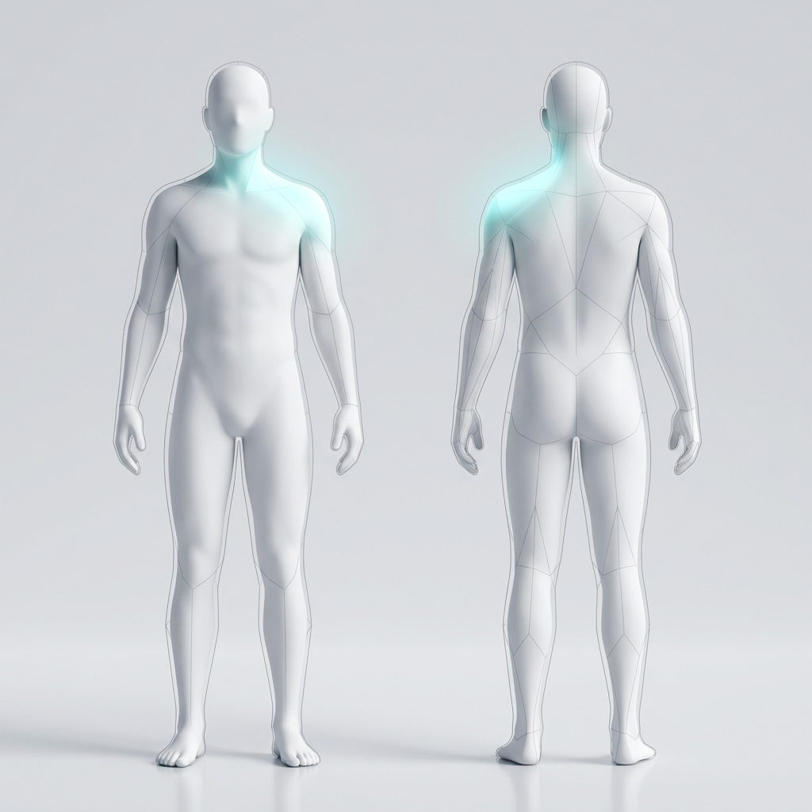

# 3D Locator Style Board (Handoff 1)

**PROTOTYPE — NOT CLINICALLY REVIEWED**

```text
status: prototype
reviewed_by: ""
reviewed_date: ""
source_url_or_provider: Gemini 3.1 Pro (High)
generation_method: AI Image Generation (Imagen)
generation_date: 2026-08-27
replacement_required: true
```

## Mission
Created 4 visual directions for a calm, inclusive, low-detail human model to validate the 3D locator experience. These assets are for internal preview and design/technical testing.

## Visual Directions

### 1. Minimalist Clay

- **Prompt:** A calm, inclusive, low-detail full-body human model in a neutral standing pose, front and back orientation. The visual style is minimalist matte clay, warm beige/grey, with very soft shadows and smooth, flowing surfaces. No internal-organ details. The neck or shoulder region has a subtle, pastel painted highlight. Clean light background, framed for both mobile and desktop layouts. No diagnostic labels or text.
- **Settings:** Aspect ratio 1:1.

### 2. Frosted Glass

- **Prompt:** A calm, inclusive, low-detail full-body human model in a neutral standing pose, front and back orientation. The visual style is frosted glass or translucent silicone with soft, diffused lighting and smooth surfaces without sharp internal-organ details. The neck or shoulder region has a subtle, warm glowing highlight treatment. Clean background, framed for both mobile and desktop layouts. No diagnostic labels or text.
- **Settings:** Aspect ratio 1:1.

### 3. Soft Ambient

- **Prompt:** A calm, inclusive, low-detail full-body human model in a neutral standing pose, front and back orientation. The visual style is abstract and smooth like a pearl mannequin with pastel ambient lighting. No internal-organ details. The neck or shoulder region is highlighted by a gentle, localized colored light shining softly on the surface. Clean background, framed for both mobile and desktop layouts. No diagnostic labels or text.
- **Settings:** Aspect ratio 1:1.

### 4. Wireframe Solid

- **Prompt:** A calm, inclusive, low-detail full-body human model in a neutral standing pose, front and back orientation. The visual style combines smooth solid surfaces with clean, abstract wireframe elements to feel technical yet approachable. No internal-organ details. The neck or shoulder region has a subtle, glowing filled highlight. Clean background, framed for both mobile and desktop layouts. No diagnostic labels or text.
- **Settings:** Aspect ratio 1:1.

## Recommendation
**Minimalist Clay** is the approved direction (Supervisor reviewed: accepted with follow-up). It feels calm, deeply human, and avoids the "clinical/robotic" feeling that translucent or wireframe models often convey. The warm matte surface makes colored region highlights highly visible on mobile devices without relying on complex rendering features like transmission or subsurface scattering, aligning with our performance budgets.

### Required Adjustments Before Modelling
- **Silhouette:** Use a more body-neutral silhouette; the initial concept is strongly feminine.
- **Highlight:** Replace the painted shoulder stripe with a localized, clearly bounded region highlight.
- **Accessibility:** Add a non-color selection cue such as an outline, halo, or text label.
- **Material:** Keep material matte; avoid realistic skin shading.
- **Validation:** Test the highlight in light/dark themes and color-vision simulations.
- **Anatomy:** Do not copy generated anatomical proportions without reference review.

## Known Visual Risks
- **Highlight contrast:** Subtle highlights on soft surfaces can fail WCAG contrast requirements. We must ensure the selected region's text label and tint provide enough confidence for visually impaired users.
- **Anatomical interpretation:** Even low-detail models have implied joints and muscle groups. The "Minimalist Clay" style must be modeled carefully to avoid implying specific diagnoses by adding too much definition to certain areas.
- **Lighting performance:** Real-time web rendering of "Frosted Glass" or "Soft Ambient" lighting (transmission, ambient occlusion) can quickly exceed our 3D performance budget on low-end mobile devices. 

## Replacement / Production Notes
- These images are concept art only and are not 3D models.
- When creating the final GLB asset, use this board to guide the material definition (e.g., roughness, metalness, base color).
- The final full-body model must be built with independent selectable meshes or enlarged hit meshes for regions as outlined in the `3D-TECHNICAL-ARCHITECTURE.md`.
